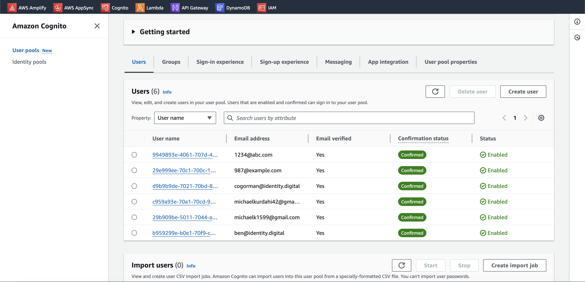
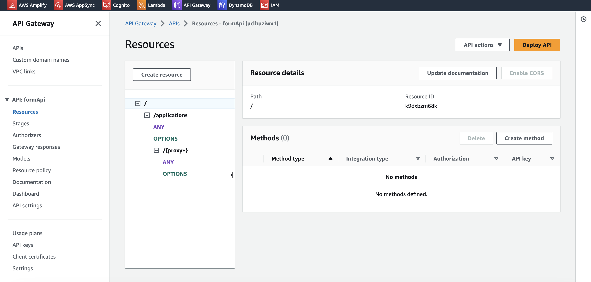
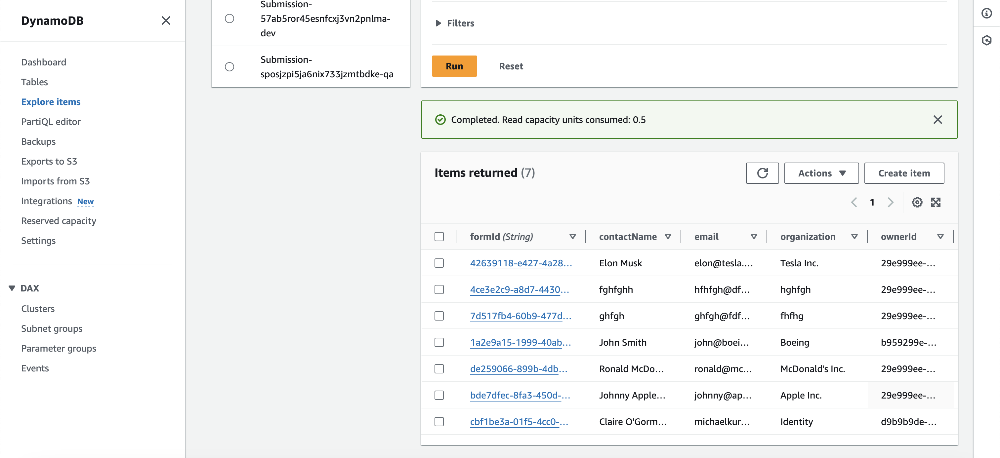
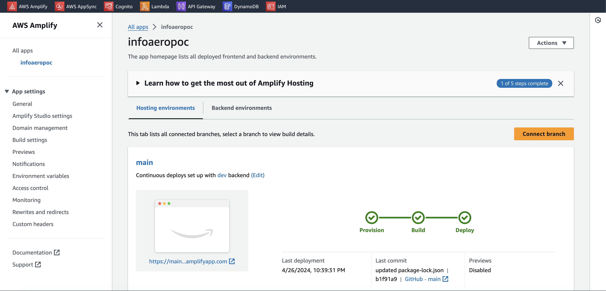
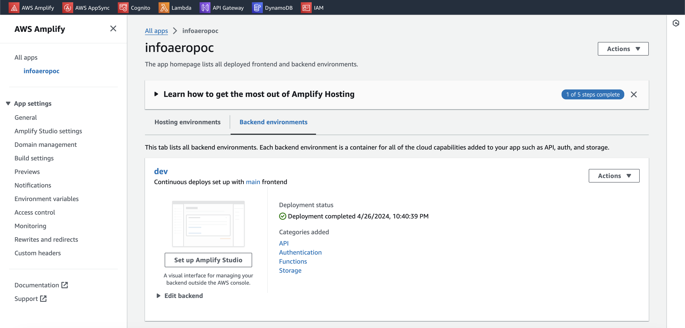

# Info-Aero POC Documentation

## Overview

This project is designed to modernize, update, and streamline the existing Information.aero site that runs on Drupal by transitioning it to a more scalable and secure AWS ecosystem. By leveraging Amazon Web Services (AWS), the system enhances performance, scalability, and manageability.

## AWS Services Used

- **Amazon Cognito**: Manages user authentication and handles user groups for different access levels.

- **AWS Lambda and Amazon API Gateway**: Serve as the backend, processing API requests to and from the front end.

- **Amazon DynamoDB**: Provides a scalable and managed NoSQL database for storing application data.

- **AWS Amplify**: Integrates frontend and backend components, simplifies deployments, and manages hosting.

## React for Frontend

- The frontend is built using React, offering a dynamic user experience and efficient updates to the UI in response to data changes.

## GitHub for Version Control and CI/CD Integration

AWS Amplify integrates seamlessly with GitHub to provide version control along with continuous integration and deployment (CI/CD) capabilities. This setup ensures efficient management of the application's codebase and facilitates automated processes for building and deploying applications.

### Frontend Updates

When changes to the frontend are pushed to a remote repository on GitHub, AWS Amplify automatically detects these changes. The CI/CD pipeline configured within Amplify then triggers a new build and deployment process. This automated workflow ensures that any updates made to the frontend are immediately reflected in the live application, without the need for manual interventions.

### Backend Updates

For backend updates involving AWS services like Lambda functions or API Gateway configurations, the process requires an additional step with the Amplify CLI. While frontend updates utilize a direct `git push` to trigger builds, backend changes need to be deployed using the `amplify push` command. This command synchronizes the local changes with the cloud, updating the necessary AWS resources. Once these changes are pushed, Amplify automatically triggers a rebuild of the backend resources to apply the updates.

It's crucial to differentiate between the triggers for frontend and backend updates:

- **Frontend**: Automatically rebuilds upon `git push` to the GitHub repository. This includes changes to static assets, React components, stylesheets, and other frontend-related files.
- **Backend**: Requires an `amplify push` for changes in configurations and resources (such as Lambda, API Gateway, Cognito) to be updated in AWS. After the push, Amplify handles the deployment and updates the cloud resources accordingly.

This CI/CD integration not only streamlines the development process but also enhances the overall deployment workflow, ensuring that both frontend and backend components of the application are consistently up-to-date and in sync with the version-controlled source code. This mechanism is crucial for maintaining the reliability and integrity of the application across different development stages and production environments.

## Setup Instructions

1. **AWS Account**: Ensure that all AWS services are set up under a single AWS account for ease of management. These services can be configured to work with other AWS accounts as needed.

2. **Amplify Initialization**:
   - Run `amplify init` in the project directory to initialize AWS Amplify, which configures the environment and sets up AWS services.

3. **Authentication Setup**:
   - Use `amplify add auth` to configure Amazon Cognito for user authentication. This includes setting up user groups such as 'SITA' and 'Registrant'.

4. **API Configuration**:
   - Execute `amplify add api` to set up REST APIs using Amazon API Gateway linked with AWS Lambda for server-side logic.

5. **Database Configuration**:
   - Use `amplify add storage` to integrate Amazon DynamoDB for managing application data.

6. **Local Testing**:
   - Use `npm start` to run your React application locally. This allows you to test the user interface and its interactions with the backend in a development environment.

7. **Deploying the Application**:
   - Deploy the application using `amplify publish` which builds the entire front and backend resources and deploys them in AWS.

## User Access and Functionality

### Differentiated Access Control

Our application implements robust access control that differentiates between two types of users: SITA group users and Registrants. This is facilitated through AWS Cognito, which manages user identities and groups.

- **SITA Group Users**: Users belonging to the SITA group have administrative access which allows them to view all applications submitted in the database. This comprehensive access is useful for administrators who need to oversee the entire scope of submissions.
  
- **Registrants**: Regular users or Registrants have more restricted access. They can only view applications they have personally submitted. This is implemented using AWS Cognito's claims['sub'], which acts as a unique identifier (ownerId) for each user. This ensures that users can consistently submit and track their applications across different sessions and even if they use different email addresses, as long as they are connected to the same user account.

---

### Application Pages

Below are screenshots of the application that demonstrate the user interface for both SITA and Registrant users:

- **Form Submission Page**: This page is accessible to all users for submitting new applications. It is straightforward and user-friendly, ensuring that users can easily provide all necessary information.

- **SITA Applications Overview**: This page is exclusively accessible to users in the SITA group. It displays all the applications from different users, providing SITA members with a comprehensive view of all submissions. If you would like to view it on the live site as a **SITA User** with the link provided at the end of this README, use these credentials
    - **Email: 123@abc.com**
    - **Password: `1234567**

- **Registrant Applications Overview**: This page is tailored for Registrant users. It displays only the applications submitted by the logged-in user, leveraging the `claims['sub']` from AWS Cognito as a unique identifier to fetch and show only the user's submissions. This feature allows Registrants to track their submitted applications effectively, providing a personalized user experience. If you would like to view it on the live site as a **Registrant** with the link provided at the end of this README, use these credentials
    - **Email: 987@example.com**
    - **Password: `1234567**

These pages are designed to cater to the specific needs of different user groups, ensuring that all users can interact efficiently with the application while adhering to the necessary access controls established through AWS Cognito.

### Technical Implementation

For the backend logic, please refer to the `amplify/backend/function/src/index.js` file in the GitLab repository, where you can see how we've implemented these controls using AWS Lambda and API Gateway. The function leverages the AWS SDK to interact with DynamoDB, checking user group membership and setting permissions accordingly.

## Conclusion

This POC demonstrates a robust application capable of replacing the current Drupal-based system, offering a modern, scalable, and secure platform. By following the setup instructions and utilizing AWS and React, the Info-Aero system is well-positioned for future growth and enhancements.

Here is the live link to be able to view the application currently being hosted on Amplify: https://main.d31pmbebzbo2jd.amplifyapp.com/